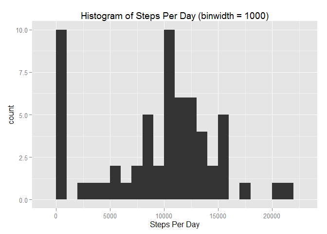
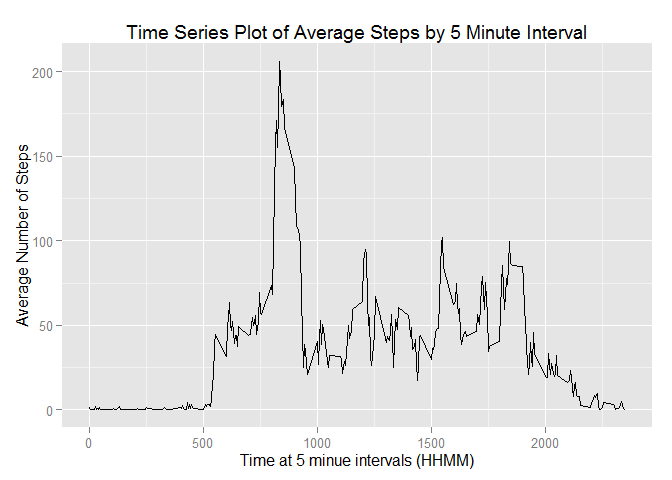
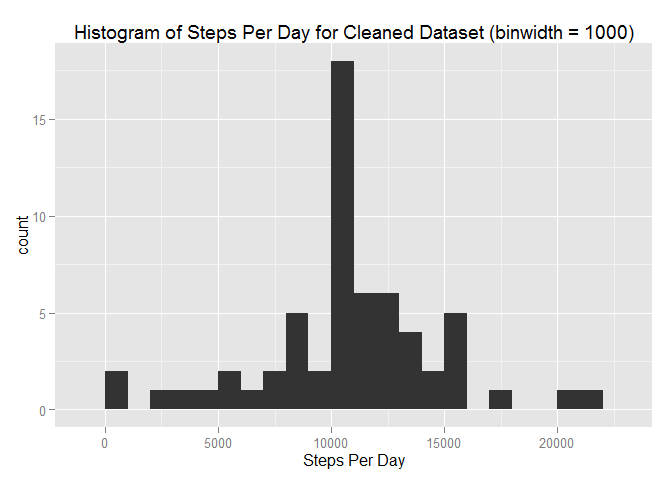
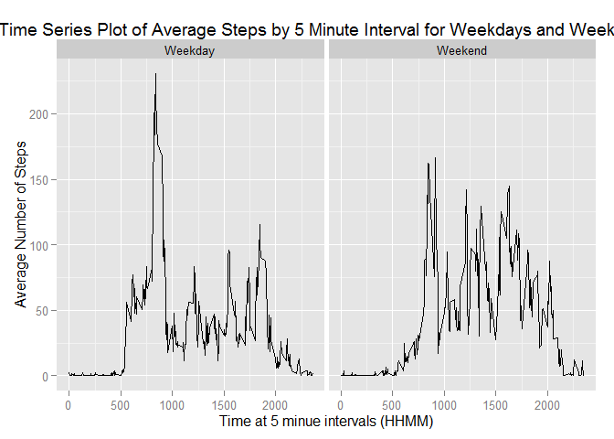

# Reproducible Research: Peer Assessment 1


## Loading and preprocessing the data

Read the csv file and convert the Date column into a date format.


```r
data <- read.csv("activity.csv",header = TRUE)
data$date <- as.Date(data$date, format="%Y-%m-%d")
```

## What is mean total number of steps taken per day?


```r
library(ggplot2)
```

```
## Warning: package 'ggplot2' was built under R version 3.2.1
```

```r
#calculate steps per day
steps.per.day<-aggregate(x=data$steps, by = list(data$date), FUN=sum, na.rm=TRUE)
names(steps.per.day)<-c("date","steps")
#create histogram
hist<-ggplot(steps.per.day,aes (x = steps)) + 
    ggtitle("Histogram of Steps Per Day (binwidth = 1000)") +
    xlab("Steps Per Day") +
    geom_histogram(binwidth = 1000)
hist
```

 

```r
#calculate mean and median of steps per day
m.steps<-round(mean(steps.per.day$steps),0)
med.steps<-median(steps.per.day$steps)
```

The mean number of steps per day is 9354.  
The median number of steps per say is 10395.


## What is the average daily activity pattern?


```r
#calculate averages per interval
steps.ave.interval<-aggregate(x=data$steps, 
                              by = list(data$interval), FUN=mean, na.rm=TRUE)
names(steps.ave.interval)<-c("interval","steps")

#create plot of averages
step.plot <- ggplot(steps.ave.interval,aes(interval,steps)) +
    ggtitle("Time Series Plot of Average Steps by 5 Minute Interval") +
    xlab("Time at 5 minue intervals (HHMM)") +
    ylab("Average Number of Steps") +
    geom_line()
step.plot
```

 

```r
#find the interval with the max number of average steps
max.steps<-which.max(steps.ave.interval$steps)
max.time<-steps.ave.interval[max.steps,1]
```

The maximum number of steps was at the 104th time interval.  
This corresponds to a time of 835.

## Imputing missing values


```r
#calculate the number of missing rows
missing.rows<-nrow(data[is.na(data$steps),])
```

The number of missing rows is 2304.  

The strategy we will employ to fill in the missing rows is to substitute the average for that time interval.

```r
data.cleaned<-data
data.cleaned$steps[is.na(data.cleaned$steps)]<-
    tapply(data.cleaned$steps, data.cleaned$interval,mean, na.rm=TRUE)

#recreated the steps per day dataset with the cleaned data
cleaned.steps.per.day<-aggregate(x=data.cleaned$steps, 
                            by = list(data.cleaned$date), FUN=sum)
names(cleaned.steps.per.day)<-c("date","steps")

cleaned.hist<-ggplot(cleaned.steps.per.day,aes (x = steps)) + 
    ggtitle("Histogram of Steps Per Day for Cleaned Dataset (binwidth = 1000)") +
    xlab("Steps Per Day") +
    geom_histogram(binwidth = 1000)

#calculate mean and median of steps per day
m.cleaned.steps<-as.integer(mean(cleaned.steps.per.day$steps))
med.cleaned.steps<-as.integer(median(cleaned.steps.per.day$steps))
hist
```

 

```r
cleaned.hist 
```

 

The mean of the original dataset was 9354.  
The mean of the cleaned dataset is 10766.  
The median of the original dataset was 10395.  
The median of the cleaned dataset 10766.  

Imputting the missing values has removed the large number of low average steps per day evident in the first histogram. The cleaned data is more symmetrical around the mean, which is now the same as the median, both of which are higher than in the original dataset. 


## Are there differences in activity patterns between weekdays and weekends?


```r
#create a variable that determines whether a weekend or weekday
data.cleaned$date <- as.Date(data.cleaned$date, format="%Y-%m-%d")
data.cleaned$weekday<-as.factor(ifelse(weekdays(data.cleaned$date) 
                                       %in% c("Saturday","Sunday"),"Weekend","Weekday"))
#create averages for intervals for weekends and weekdays
steps.ave.interval.weekday<-aggregate(x=data.cleaned$steps, 
        by = list(data.cleaned$interval, data.cleaned$weekday), FUN=mean, na.rm=TRUE)
names(steps.ave.interval.weekday)<-c("interval","weekday","steps")

#recreate the time series plots for weekends and weekdays
weekday.plot<-ggplot(steps.ave.interval.weekday,aes(interval,steps)) + 
    ggtitle("Time Series Plot of Average Steps by 5 Minute Interval for Weekdays and Weekends") +
    facet_grid(. ~ weekday) +
    xlab("Time at 5 minue intervals (HHMM)") +
    ylab("Average Number of Steps") +
    geom_line()
weekday.plot
```

 
